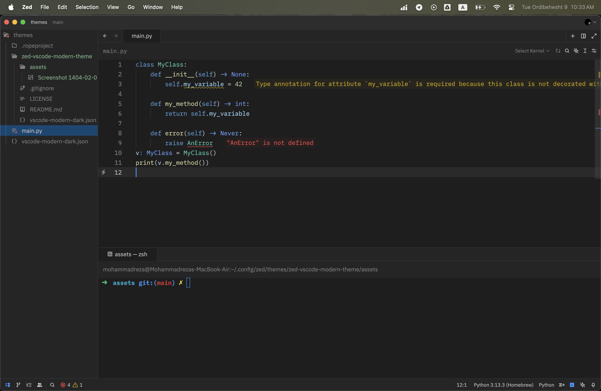

# VSCode Dark Modern theme for Zed

This is a theme for the [Zed code editor](https://zed.dev/), inspired by the popular "Dark Modern" theme from Visual Studio Code. It aims to bring a similar look and feel to your Zed environment.

## Screenshot

## How to Use

Store new themes locally by placing them in the `~/.config/zed/themes` directory.

For example, to create a new theme called `vscode-dark-modern`, create a file named `vscode-dark-modern.json` in that directory and paste the theme’s JSON code inside it.

It will be available in the theme selector the next time Zed loads.

Find more themes at [zed-themes.com](https://zed-themes.com).

6.  Zed should apply the theme immediately. Enjoy!
